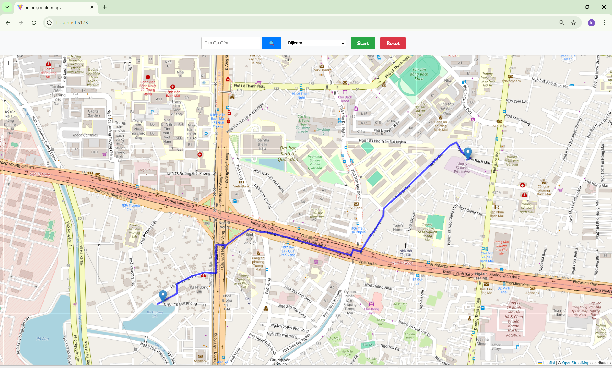

# AI Project 2025.1: Ứng dụng Tìm Đường Đi Ngắn Nhất

Đây là dự án giữa kì cho môn Nhập môn AI, tập trung vào chủ đề **Tìm đường đi ngắn nhất**.

| Dịch vụ | Công nghệ | Cổng (Port) | Ghi chú |
| :--- | :--- | :--- | :--- |
| **Frontend** | React, Vite, Leaflet | **5173** | Giao diện bản đồ (Truy cập bằng `http://localhost:5173`) |
| **Backend** | FastAPI, Python | **3000** | API xử lý thuật toán tìm đường (Frontend sẽ gọi đến `http://localhost:3000`) |

-----

## 1\. Mô Tả Dự Án

Dự án là một ứng dụng web mô phỏng chức năng tìm đường đi trên bản đồ ("mini-google-maps").

  * **Giao diện (Frontend)**: Được xây dựng bằng **React** và **Vite**, sử dụng thư viện **Leaflet** để hiển thị bản đồ tương tác. Giao diện cho phép người dùng chọn điểm bắt đầu (Start), điểm kết thúc (End), và lựa chọn thuật toán tìm đường.
  * **Xử lý (Backend)**: Được xây dựng bằng **FastAPI** (Python), đóng vai trò là API xử lý logic tìm đường.
  * **Nguồn dữ liệu**: Dữ liệu đường (way) và điểm (node) được lấy từ **OpenStreetMap (OSM)** thông qua **Overpass API** dựa trên khu vực hiển thị của bản đồ (BBox).
  * **Các thuật toán tìm đường được triển khai**:
      * **Dijkstra** (Thuật toán mặc định)
      * **A\*** (A-Star)
      * **BFS** (Breadth-First Search)
      * **DFS** (Depth-First Search)

-----

## 2\. Demo Ứng Dụng



-----

## 3\. Hướng Dẫn Triển Khai

Có hai cách để triển khai dự án: sử dụng Docker Compose hoặc chạy từng phần cục bộ.

### Cách 1: Triển khai bằng Docker Compose (Khuyến nghị)

Cách này đơn giản nhất, chỉ yêu cầu máy tính của bạn đã cài đặt **Docker** và **Docker Compose**.

1.  **Clone dự án và di chuyển vào thư mục gốc:**

    ```bash
    git clone https://github.com/ducanh2006/AI-project-2025.1.git
    cd AI-project-2025.1
    ```

2.  **Khởi động các dịch vụ bằng Docker Compose:**
    Lệnh này sẽ tự động build image cho cả Backend và Frontend, sau đó khởi chạy hai container (`map_backend` và `map_frontend`).

    ```bash
    docker-compose up --build
    ```

    *Lưu ý: Nếu bạn muốn chạy dưới nền, dùng `docker-compose up -d`.*

3.  **Truy cập ứng dụng:**
    Mở trình duyệt và truy cập vào địa chỉ:
    **`http://localhost:5173`**

-----

### Cách 2: Chạy Cục Bộ (Local Setup)

Cách này yêu cầu máy tính của bạn đã cài đặt **Python** (phiên bản 3.12 hoặc tương đương) và **Node.js** (phiên bản 20.x hoặc tương đương).

#### 3.2.1. Khởi chạy Backend (FastAPI - Cổng 3000)

1.  **Di chuyển vào thư mục Backend:**

    ```bash
    cd backend
    ```

2.  **Cài đặt các thư viện Python:**

    ```bash
    pip install -r requirements.txt
    # Các thư viện cần thiết: fastapi, pydantic, requests, uvicorn
    ```

3.  **Khởi động Server FastAPI bằng Uvicorn:**

    ```bash
    uvicorn main:app --host 0.0.0.0 --port 3000
    ```

    Server Backend sẽ chạy tại **`http://localhost:3000`**.

#### 3.2.2. Khởi chạy Frontend (React/Vite - Cổng 5173)

1.  **Di chuyển vào thư mục Frontend:**

    ```bash
    cd ../frontend/mini-google-maps
    ```

2.  **Cài đặt các thư viện Node.js:**

    ```bash
    npm install
    # Các thư viện chính: react, leaflet, react-leaflet
    ```

3.  **Khởi động Server Dev của Vite:**

    ```bash
    npm run dev -- --host
    # Hoặc đơn giản hơn: vite --host
    ```

    Server Frontend sẽ chạy tại **`http://localhost:5173`**.

4.  **Truy cập ứng dụng:**
    Mở trình duyệt và truy cập vào địa chỉ:
    **`http://localhost:5173`**
    *(Lưu ý: Cả Backend và Frontend phải đang chạy đồng thời để ứng dụng hoạt động.)*